# gRPC-Based Online Voting System

The gRPC-Based Online Voting System is a web application that allows users to participate in elections and cast their votes online. This project utilizes gRPC technology to enable offer services accessible from various locations.

## Demo

| Title                          | Picture                                                                     |
| ------------------------------ | --------------------------------------------------------------------------- |
| diagram                        | 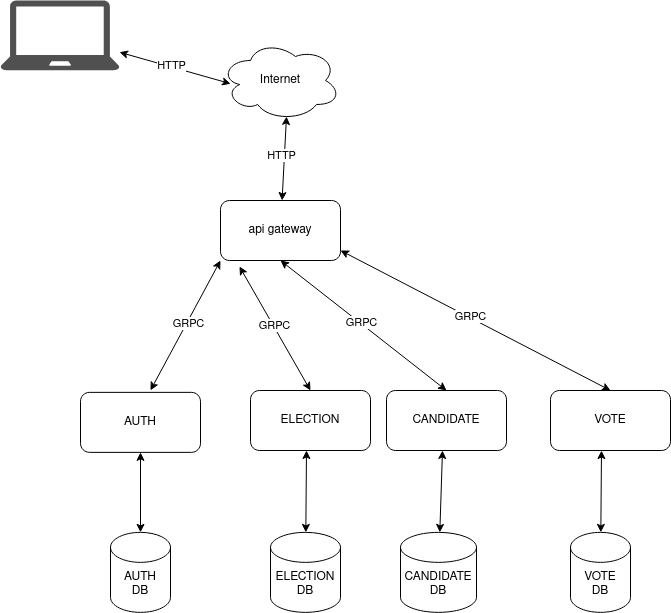                                       |
| postman end-points             | '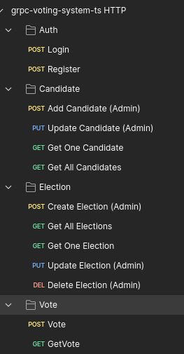                       |
| register                       | 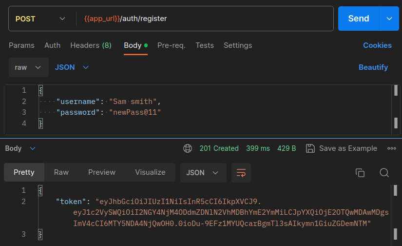                                     |
| invalid register               | 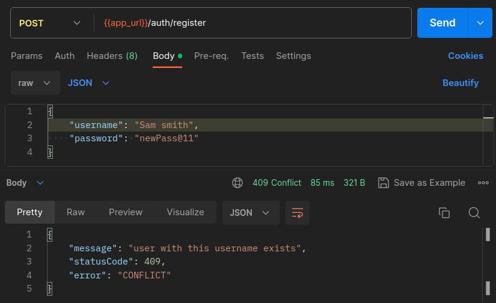                     |
| login                          | 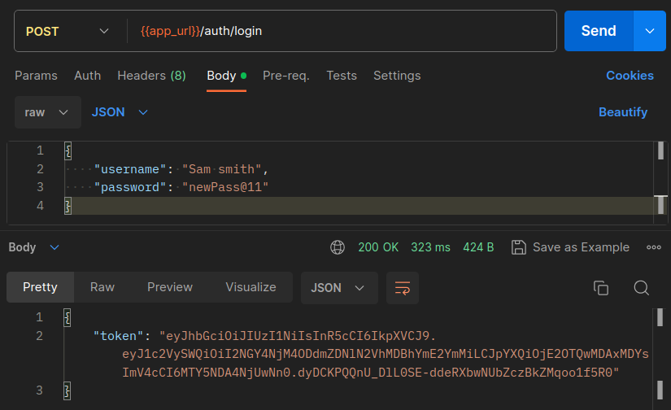                                           |
| invalid login                  | 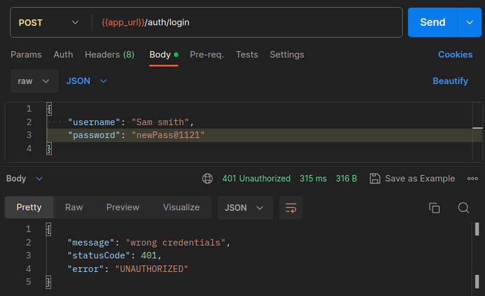                           |
| unauthorized access            | 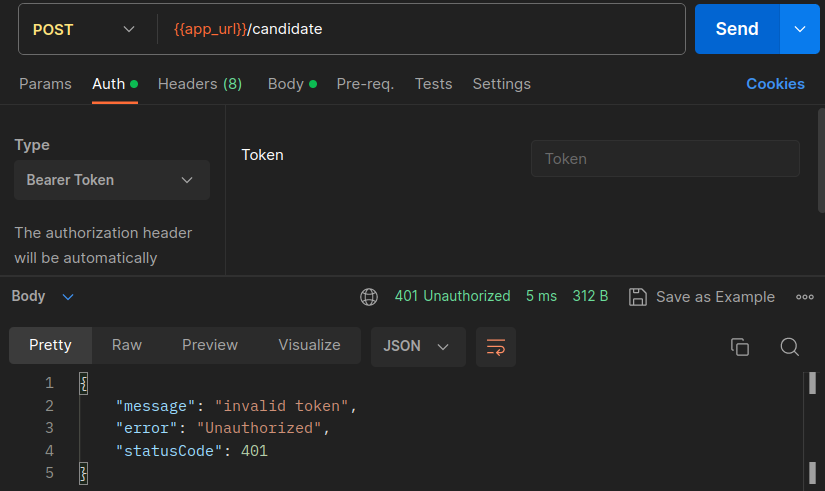                             |
| forbidden access               | 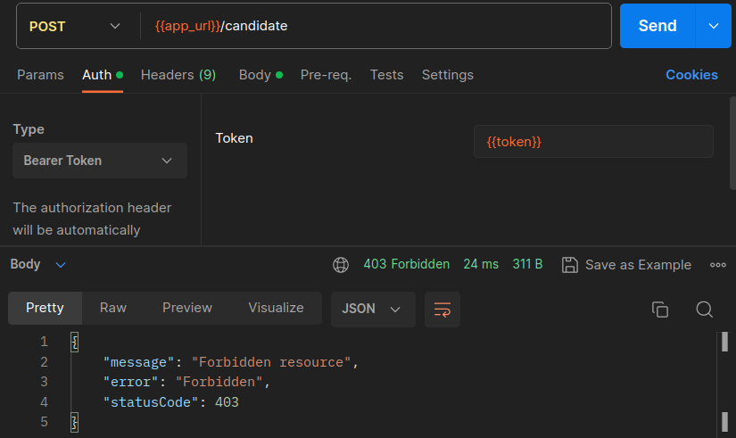                                 |
| add candidate                  | 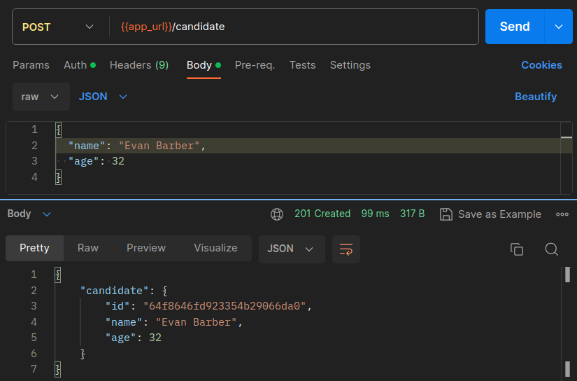                           |
| invalid add candidate          | 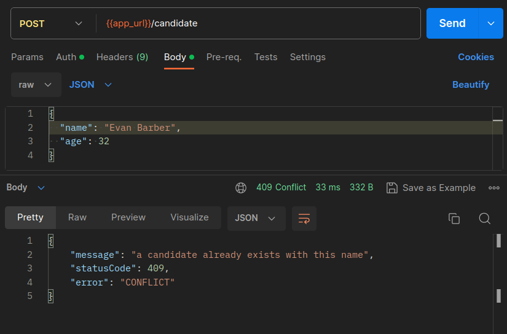           |
| get candidate                  | 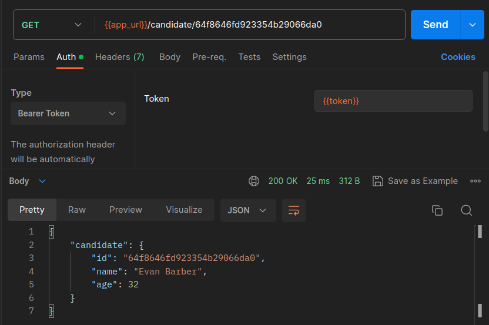                           |
| get all candidate              | 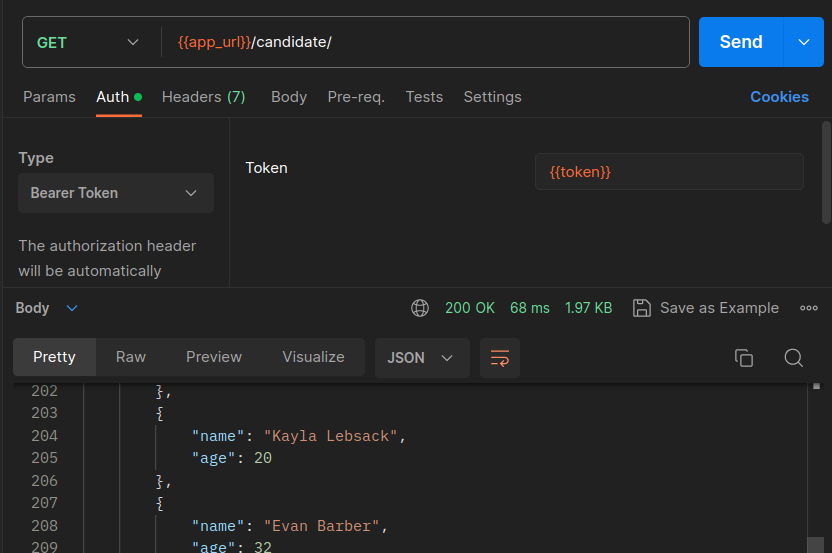                 |
| only admin can create election | 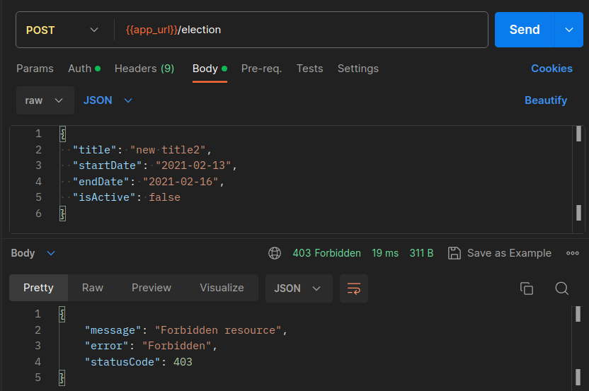 |
| create election                | 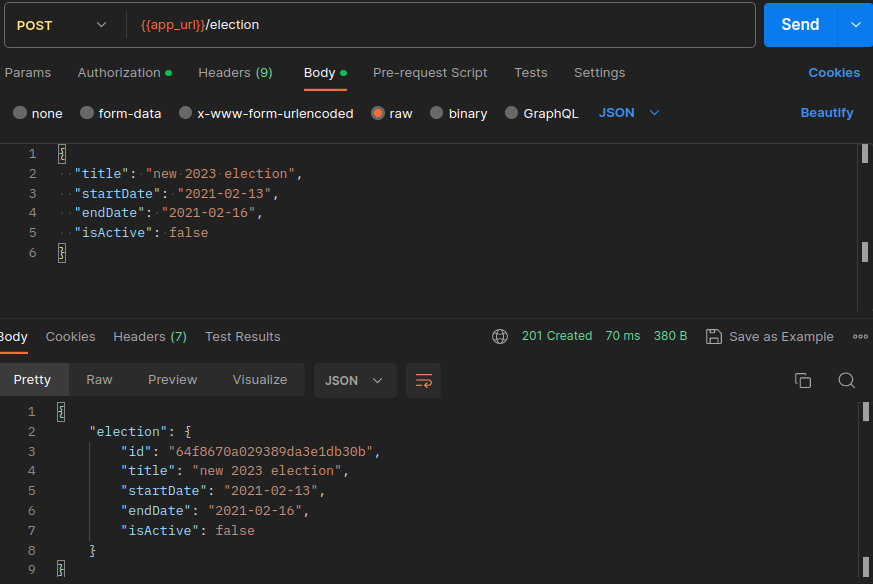                       |

## Features

- **Voter Registration:** Users can register as voters by providing required details and authentication.
- **Candidate Listings:** Display a list of candidates with their profiles and campaign information.
- **Voting:** Implement voting mechanisms to ensure the integrity and confidentiality of votes.
- **Voter Authentication:** Ensure secure user authentication to prevent unauthorized access to voting.
- **Vote Tracking:** Allow voters to track their submitted votes and verify their authenticity.

## Technologies Used

- **TypeScript:** The project is built using TypeScript for both frontend and backend development.
- **gRPC:** Utilize gRPC technology for efficient and secure communication between different components.
- **Node.js:** Use Node.js for the backend server implementation.
- **Nest.js**: by using gRPC for efficient inter-service communication and NestJS for building and managing your microservices, you can create a powerful, scalable, and maintainable microservices architecture.
- **Database/MongoDB:** Store voter profiles, candidate information, and election data in a suitable database.
- **Authentication:** Implement user authentication using secure tokens to protect voter data.

## Getting Started

1. Clone the repository:

   ```bash
   git clone https://github.com/BaseMax/grpc-voting-system-ts.git
   cd grpc-voting-system-ts
   ```

2. Install dependencies for both frontend and backend:

   ```bash
   cd ../backend
   npm install
   ```

3. Start the frontend and backend servers:

   ```bash
   npm run start:dev auth
   npm run start:dev candidate
   npm run start:dev election
   npm run start:dev vote
   npm run start:dev
   ```

4. Access the application in your web browser at `http://localhost:3000`.

## Test

to run e2e test first start up all services and apigateway then:

```bash
pnpm run test:e2e
```

## Services

**Auth Service**:

- login: user can login with correct credentials.
- register: user can register with correct credentials.
- verify: this method verify token is valid or not.
  **Candidate Service**:
- addCandidate: admin can add candidate to the election
- updateCandidate: admin can update candidate information
- getAll: user or admin can get information of all candidates
- getOne: user or admin can get information of specific candidate
  **Eelection Service**:
- createElection: admin can create election
- getAll: user or admin can get all elections informations
- getOne: user or admin can get specific election informations
- update: admin can update election information (start/stop election, change start/end Date, add/remove candidate)
  **Vote Service**:
- vote: user can vote to a candidate of election
- getVote: admin can check vote informations

## Process

- **User Authentication and Registration:** Users should be able to register with their information securely. Implement user authentication to ensure that only registered users can access the system.
- **Candidate Management:** Admins should be able to add, edit, and remove candidate. Display candidate information including their name and other details.
- **Voter Dashboard:** Voters should have access to a dashboard with information about upcoming elections, candidates, and voting instructions.
- **Voting Process:** Implement a secure and user-friendly process for casting votes. Allow voters to select their preferred candidate from the available options.
- **Admin Console:** Create an admin console/dashboard for election administrators to manage elections and candidates. Admins should have the ability to start, pause, and end elections.
- **Results Display:** Display election results in real time or after the election concludes. Show detailed breakdowns of votes for each candidate.

## Commands

convert protobuff to typescript (ready for nestjs)

```bash
protoc --plugin=./node_modules/.bin/protoc-gen-ts_proto --ts_proto_out=./libs/common/src/types --ts_proto_opt=nestJs=true ./proto/vote.proto
```

## Contribution

Contributions are welcome! If you find any issues or have suggestions for improvements, please feel free to submit a pull request or open an issue.

## License

This project is licensed under the GPL-3.0 License.

Copyright 2023, Max Base
